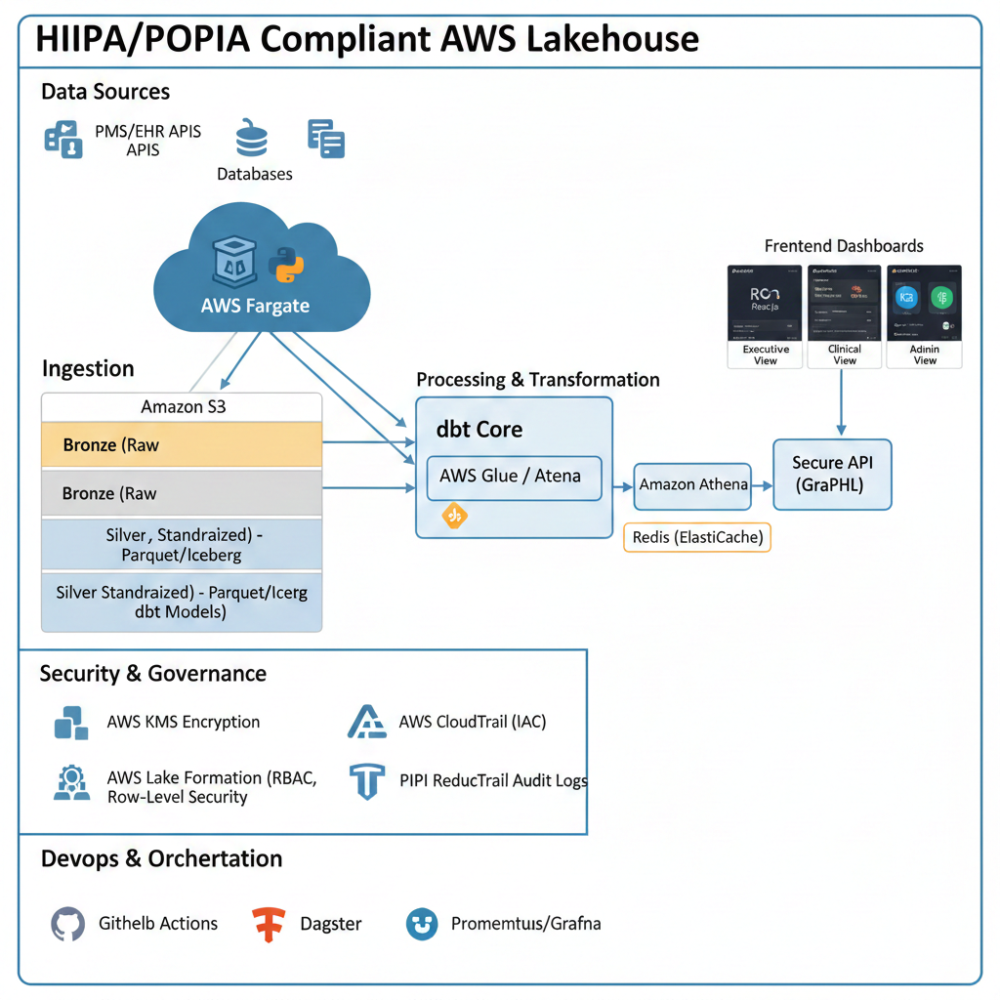

# System Architecture

This document describes the architecture for a **multi-tenant healthcare analytics platform** designed for independent medical practices.  

The system is built to provide **secure, scalable analytics** from operational, financial, and limited clinical datasets, while enforcing strict tenant isolation and PHI protection.

---

## 1. High-Level Architecture Overview

The architecture uses a **AWS Lakehouse design with Medallion layers (Bronze / Silver / Gold)** and a **decoupled compute and storage model**.  

Data is ingested from Practice Management Systems (PMS) and EHR platforms, transformed through a pipeline that enforces schema and de-identification, and finally consumed by a secure React dashboard.

Key design priorities:
- Strong multi-tenant isolation
- Minimal exposure of PHI
- SQL-first analytics layer
- Containerized ETL for portability and reproducibility

---

## 2. Component Breakdown

### A. Ingestion ("Collector")
- **Tech:** Python + Docker + AWS Fargate  
- **Role:** Extracts raw JSON/CSV data from PMS or EHR systems and writes it to the Bronze layer in S3  
- **Portfolio Value:** Demonstrates containerized ETL and handling of raw, unstructured data

### B. Storage ("Heart")
- **Tech:** Amazon S3  
- **Bronze Layer:** Raw, immutable files  
- **Silver Layer:** Cleaned Parquet files with schema enforcement  
- **Gold Layer:** Business-level aggregates (e.g., monthly revenue by doctor)  
- **Portfolio Value:** Shows understanding of layered storage, cost-optimized Parquet files, and Medallion patterns

### C. Processing & Analytics ("Brain")
- **Tech:** AWS Glue + Amazon Athena + dbt-core  
- **Role:** Athena provides serverless SQL queries; dbt manages transformations from Bronze → Silver → Gold  
- **Portfolio Value:** Demonstrates SQL skills, data modeling, and pipeline orchestration

### D. Frontend Dashboard ("Face")
- **Tech:** React app  
- **Role:** Queries Gold tables via Athena and displays multi-tenant dashboards (Doctor, Admin, Practice Owner)  
- **Portfolio Value:** Closes the loop from raw data to actionable insights

---

## 3. Data Flow

1. Python ETL container writes synthetic data to `s3://bucket/bronze/`  
2. AWS Glue crawlers infer schema and update the Athena Catalog  
3. dbt runs SQL transformations to create Silver and Gold tables  
4. React frontend queries Gold tables filtered by `tenant_id` for multi-tenant views

---

## 4. Security & Tenant Isolation

Even in a simplified architecture, security is fundamental:

- Each practice’s data is **partitioned by `tenant_id`** in S3  
- React dashboard queries include `WHERE tenant_id = 'X'` clauses  
- In production, row-level security would be enforced via **IAM policies** or **AWS Lake Formation**  
- PHI is de-identified in the Silver layer  
- Encryption is applied at rest (S3 + KMS) and in transit  
- All queries and data access can be audited via Athena logs and CloudTrail

---

## 5. Technology Stack

| Layer | Tool / Service | Purpose |
|-------|---------------|--------|
| Compute | Docker + AWS Fargate | Containerized ETL pipelines |
| Storage | Amazon S3 (Parquet format) | Durable, low-cost storage with layered Medallion design |
| Transformation | dbt-core | SQL-based transformations and documentation |
| Analytics Engine | Amazon Athena | Serverless querying and cost efficiency |
| Orchestration | AWS Glue | Schema inference, ETL coordination |
| Frontend | React | Multi-role dashboards with tenant-specific views |
| Caching | Optional: Redis / ElastiCache | Optimize frequent queries and dashboard performance |

---

## 6. Data Domains

| Domain | In-Scope Data | Out-of-Scope |
|--------|---------------|--------------|
| Clinical (Limited) | Diagnosis codes (ICD-10), vitals trends, referral patterns | Full clinical notes, DICOM images, real-time telemetry |
| Financial | Claim status, AR aging, revenue per CPT code | Payroll, tax filing, general ledger |
| Operational | No-show rates, room utilization, wait times | Inventory / supply chain management |

- External PMS/EHR data is **read-only**  
- Dashboard allows limited write-back for internal annotations and goals

---

## 7. Design Decisions

- **Bronze → Silver → Gold:** Enables clean lineage and schema enforcement  
- **Athena over Redshift:** Pay-per-query engine keeps costs low and eliminates server management  
- **dbt for transformations:** Provides reproducible, documented SQL pipelines  
- **Docker + Fargate:** Ensures ETL portability and scalability  
- **React frontend:** Flexible multi-role dashboards without introducing complex server-side logic

---

## 8. Disclaimer

This architecture is **portfolio-focused** and uses **synthetic datasets only**.  

It demonstrates system design, multi-tenant handling, and pipeline orchestration without claiming production readiness or regulatory compliance.
